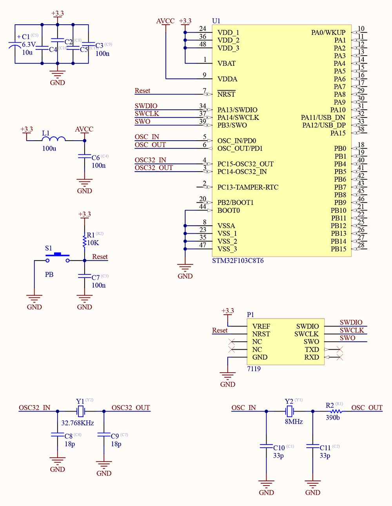

# STM32F103C8 Minimum Hardware
This document provides an overview of the minimum hardware components and connections required to successfully set up and operate an **STM32F103C8** microcontroller.

## 1. **Power Supply**
* **VDD:** Connect to 3.3V.
* **VSS:** Connect to ground.
* **VDDA:** Connect to 3.3V (used for ADC and analog peripherals).
  * Optional: Use an LC filter with a 10µH inductor and a 100nF capacitor to reduce analog noise.
* **Decoupling Capacitors:** Place **0.1µF** (ceramic) and **10µF** (electrolytic or tantalum) capacitors in parallel near each VDD pin to reduce supply noise and improve stability.

## 2. **Reset Circuit**
* **Pull-up Resistor:** 10kΩ connected to the **NRST** pin.
* Optional **Reset Button:** One side connected to **NRST**, the other to GND.
* Optional: Place a 100nF capacitor between NRST and GND to filter noise during reset.

## 3. **Oscillator Circuit**
* **High-Speed External (HSE) Oscillator:** 8MHz crystal.
* Connect the crystal between **OSC\_IN** and **OSC\_OUT** pins.
* **Load Capacitors:** 18–33pF between each crystal pin and GND.
* Alternatively, use the internal 8MHz RC oscillator if precision is not critical.
* **Low-Speed External (LSE) Oscillator:** 32.768kHz crystal for Real-Time Clock (RTC) operation.
* Connect the crystal between **OSC32\_IN** and **OSC32\_OUT** pins.
* **Load Capacitors:** 6–22pF between each crystal pin and GND.
* Alternatively, use the internal 40kHz RC oscillator (LSI) if high accuracy is not required.

## 4. **Programming / Debug Interface**
* **SWD Programmer** (e.g., ST-Link V3).
* Required connections:
  * **SWDIO**, **SWCLK**, **NRST**, **SWO** ,**VDD (3.3V)**, and **GND**.

## 5. **Boot Configuration**
* **BOOT0 Pin:**
  * Connect to GND for normal boot from main Flash memory.
  * Connect to 3.3V to enable system memory bootloader (used for UART, USB, or CAN bootloading).
  * For flexibility, use a jumper or DIP switch to select between GND and 3.3V.
* **BOOT1 Pin:**
  * Internally mapped via option bytes; in most designs, it can be tied to GND through a pull-down resistor.

## 6. **Minimal Schematic**
Below is a simplified schematic for stable **STM32F103C8** operation:

# 🌟 Support Me
If you found this repository useful:
- Subscribe to my [YouTube Channel](https://www.youtube.com/@aKaReZa75).
- Share this repository with others.
- Give this repository and my other repositories a star.
- Follow my [GitHub account](https://github.com/aKaReZa75).
  
# ✉️ Contact Me
Feel free to reach out to me through any of the following platforms:
- 📧 [Email: aKaReZa75@gmail.com](mailto:aKaReZa75@gmail.com)
- 🎥 [YouTube: @aKaReZa75](https://www.youtube.com/@aKaReZa75)
- 💼 [LinkedIn: @akareza75](https://www.linkedin.com/in/akareza75)